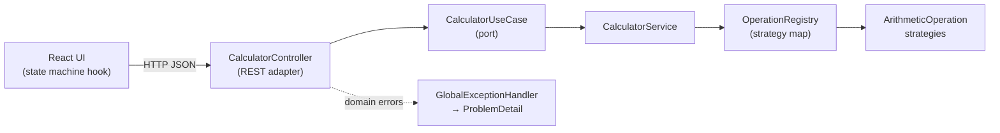

# Fullstack Calculator

A calculator made with  **React 19 + TypeScript** SPA consuming a **Java 25 + Spring
Boot 4** microservice that performs arithmetic operations.

## Architecture



- **Backend** ([backend/README.md](backend/README.md)) — hexagonal: a pure domain, one driving port, one REST adapter. No driven ports, because there is nothing to persist or call. Operations are Strategy classes resolved through a registry: a new operation is one enum constant + one class.
- **Frontend** ([frontend/README.md](frontend/README.md)) — feature-based structure with a typed API client, an explicit state machine instead of combinable booleans.

## Design decisions

Full rationale in the [ADR records](docs/adr/).

## Run

**Local** (JDK 25, Node 20+):

```bash
cd backend && ./mvnw spring-boot:run        # API on :8080
cd frontend && npm install && npm run dev   # UI on :5173 (proxies /api to :8080)
```

**Docker**:

```bash
docker compose up -d --wait                 # UI on :5173, API on :8080
```

## API

`POST /api/v1/calculator/calculate` - operations:

```bash
curl -X POST http://localhost:8080/api/v1/calculator/calculate \
  -H "Content-Type: application/json" \
  -d '{"operation":"ADD","operandA":1,"operandB":2}'
# {"operation":"ADD","result":3}

curl -X POST http://localhost:8080/api/v1/calculator/calculate \
  -H "Content-Type: application/json" \
  -d '{"operation":"DIVIDE","operandA":10,"operandB":0}'
# 422 {"type":"https://calculator.mfpe.com/errors/division-by-zero",
#      "title":"Division by zero","status":422,"detail":"Cannot divide 10 by 0", ...}
```

- Full contract with all error cases in [backend/README.md](backend/README.md)
- Live docs at `/swagger-ui.html` when the backend is running.

## Testing & coverage

| | Tests | Gate | Report |
|---|---|---|---|
| Backend (`./mvnw verify`) | 84 | JaCoCo ≥ 80% instruction/line/branch | [report](docs/coverage/backend_report.png) |
| Frontend (`npm run test:coverage`) | 18 | Vitest ≥ 80% lines/branches/functions/statements | [report](docs/coverage/frontend_report.png) |

## AI usage

Representative prompts in [docs/ai-prompts.md](docs/ai-prompts.md).
